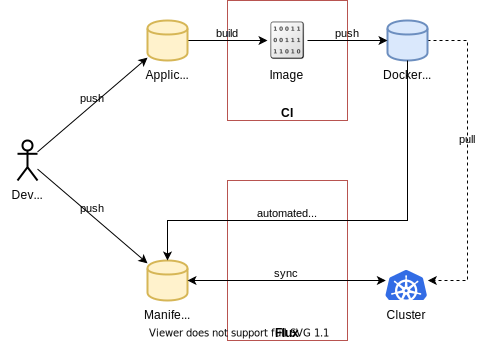

# flux-continuous-deployment-demo

This is a demo of Continuous Deployment with Flux [automated deployment of new container images](https://docs.fluxcd.io/en/stable/references/automated-image-update.html).

## Introduction

This is a typical flow of GitOps:


Continuous Deployment with Flux:



## Getting Started

### Set up

You need the following tools:

- Docker
- Kind
- Helmfile
- fluxctl

Create a cluster.

```sh
make cluster
export KUBECONFIG=output/kubeconfig.yaml
```

Deploy the manifests manually.

```sh
make deploy-app
make port-forward-app
```

Open http://localhost:10080 and make sure the demo app is shown.

Deploy Flux.

```sh
kubectl create ns monitoring
kubectl create ns flux
make deploy-flux
```

Get the public key of Flux.

```sh
fluxctl --k8s-fwd-ns flux identity
```

Open https://github.com/int128/flux-continuous-deployment-demo/settings/keys and add the deploy key.

You can see the log of Flux.

```sh
make flux-logs
```

### Deploy the application

```sh
make port-forward-app
```

Open http://localhost:10080 and make sure the demo app is shown.

```sh
make flux-logs
```

Push a commit to the default branch of https://github.com/int128/hellopage.

Flux will create a commit to this repository to update the image tag of deployment.

### Clean up

```sh
make delete-cluster
```
